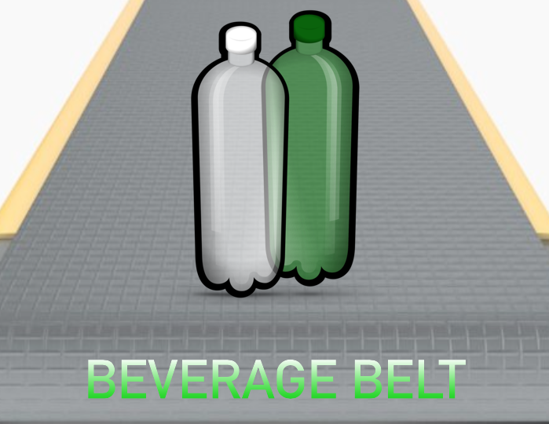
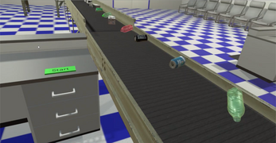
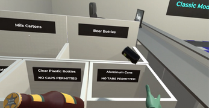
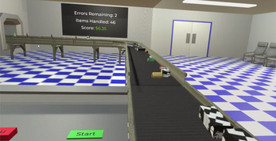

# Beverage Belt: VR Recycling Sorting Simulation

## Overview

Beverage Belt is a virtual reality sorting simulation developed for PC-tethered Meta Quest architecture in which the player must sort recyclable beverage containers from a moving conveyor belt into the correct disposal bins.

The project was designed as both a fast-paced VR game and a proof-of-concept for how virtual reality could be used for training in environments that involve conveyor belts, object sorting, and time-sensitive decision-making.

Players must quickly identify container types, prepare them correctly (e.g., removing bottle caps or pop tabs), and sort them into the correct bins while the conveyor belt continuously delivers new items.

---

## Project Motivation

This project was developed to explore how virtual reality could simulate conveyor-based sorting workflows in a safe and controlled environment.

The system was designed with potential real-world training applications in mind, such as recycling depots and sorting facilities, where new employees must learn how to quickly identify, prepare, and sort items while following specific quality-control rules.

By simulating these workflows in VR, new employees could be trained without risk of injury, equipment damage, or workflow disruption.

This project was a **solo endeavour**.

---

## Gameplay / Simulation Loop

The core gameplay loop consists of:

1. Beverage containers spawn onto a moving conveyor belt
2. The player grabs containers using VR controllers
3. Some containers must be prepared before sorting:
   - Bottle caps must be removed from plastic bottles
   - Pop tabs must be removed from cans
4. The player sorts containers into the correct bins:
   - Milk cartons
   - Beer bottles
   - Clear plastic bottles (no caps permitted)
   - Aluminum cans (no tabs permitted)
5. The player earns money for correct sorting and receives errors for mistakes
6. The game ends depending on the selected mode

The conveyor belt never stops, requiring the player to develop speed, accuracy, and task prioritization.

---

## Game Modes

The game includes five modes, each designed to test different aspects of performance:

- **Training Mode** — Adjustable spawn rate and conveyor belt speed
- **Classic Mode** — Earn as much money as possible before making three mistakes
- **Survival Mode** — One mistake and the game ends
- **Precision Mode** — Handle 100 items with maximum accuracy
- **Frenzy Mode** — Sort as many items as possible within two minutes

These modes were implemented using a shared core system with different rule sets and difficulty curves.

---

## Core Systems Developed

This project required the development of several gameplay and simulation systems:

- Conveyor belt movement system
- Object spawning system with randomized item properties
- Object preparation mechanics (removable bottle caps and pop tabs)
- Sorting validation system
- Error tracking system (sorting errors, handling errors, lost items)
- Scoring and money system
- Multiple game mode system
- VR interaction system (grab, release, interact)
- Menu system with laser pointer interaction
- UI system for score, accuracy, timers, and game state
- Audio feedback system

The system tracked multiple error types separately and dynamically calculated player accuracy as a percentage.

---

## Software Architecture

The project was structured using several software design patterns to ensure scalability and maintainability:

- **State Pattern** — Game states and game modes
- **Object Pooling** — Efficient spawning and recycling of beverage objects
- **Observer Pattern** — Score tracking, UI updates, and event notifications
- **Singleton Pattern** — Central game manager systems
- **Factory Pattern** — Spawning different beverage container types
- **Decorator Pattern** — Lightweight differentiation between can and bottle labels, bottle materials, and whether cans have tabs or bottles have lids
- **Strategy Pattern** — Different game mode rules and scoring systems

This architecture allowed new game modes and object types to be added without major changes to existing systems.

---

## Technical Implementation

The project was developed in **Unity** for **Oculus Rift / Rift S**.

Key technical features include:

- Physics-based VR interaction
- Moving conveyor belt with synchronized object motion
- Randomized object generation with multiple item variations
- Event-driven scoring and error tracking system
- Difficulty scaling through spawn rate and conveyor speed functions
- Multiple game modes built on a shared core framework
- UI and menu system with VR laser pointer interaction
- Performance optimization for smooth VR gameplay

---

## Development and Iteration

The system was developed iteratively with multiple updates that introduced:

- New game modes
- Adjustable difficulty systems
- Improved conveyor belt physics and object behavior
- UI readability improvements
- Scoring system redesign (points → money system)
- Performance and gameplay balancing
- Training mode for adjustable simulation parameters

This iterative development process helped refine both gameplay balance and system performance.

---

## Systems Design and Balancing

A significant portion of development focused on gameplay balancing and system tuning.  
Spawn rates, conveyor speeds, scoring systems, and error penalties were iteratively adjusted to create different difficulty curves across game modes.

For example:
- Spawn delay functions were tuned to gradually increase difficulty
- Conveyor speed was adjusted to match item spawn rates
- Scoring was redesigned from a flat point system to a variable-value money system
- Physical layout changes were made to prevent unintended player strategies
- Different game modes were balanced around accuracy, endurance, or speed

As such, this process involved designing and tuning interconnected systems rather than implementing isolated mechanics.

---

## Screenshots

---

## Summary

Beverage Belt demonstrates the design and implementation of a complete VR gameplay and simulation system involving object interaction, conveyor-based workflows, scoring systems, multiple game modes, and performance optimization.

The project also explores how virtual reality can be used to simulate real-world sorting and training scenarios in a safe and controlled environment.
